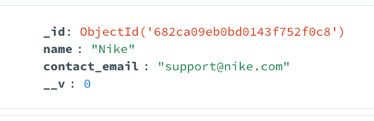
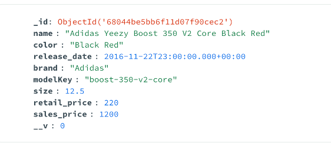
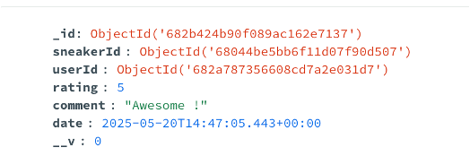
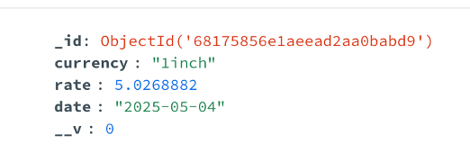
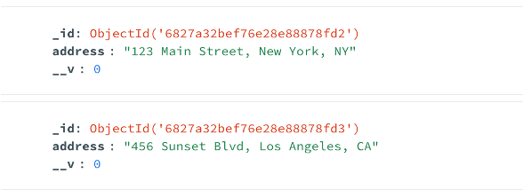
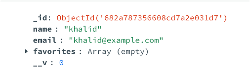

## API Overview

### API Architecture

    

Our API architecture consists of three main components:

1. **Node.js Server**: Handles REST endpoints and processes requests:
   - Performs CRUD operations on the MongoDB database
   - Fetches and stores data from external API
   - Exposes RESTful endpoints for client applications

2. **MongoDB Database**: Stores and manages application data:
   - Maintains collections for core entities
   - Persists data retrieved from external API

3. **External API**: Third-party service that provides additional data (**currencies exchange rates**)

This architecture ensures efficient data management and separation of concerns while maintaining data persistence.

### Data Models

Our **MongoDB** database is structured with 6 collections:

- 5 collections for core API entities
- 1 collection for storing external API data

Below you can find a detailed overview of our data models and their relationships:

**Providers Collection:**

**Sneakers Collection:**

**Reviews Collection:**

(references Users and Sneakers documents)

**Currencies Collection:**

**Stores Collection:**

**Users Collection:**

